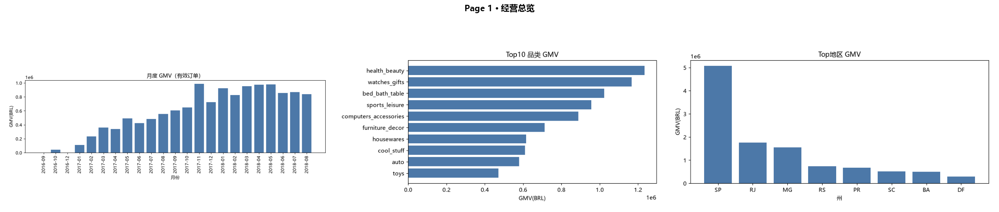

<div align="center">

# 电商经营与用户价值数据分析

**Python · MySQL · SQL · Power BI · Git**

> 基于 9.9 万笔真实电商订单，从**经营增长、用户价值、商品卖家、物流体验**四个维度完成端到端商业数据分析，并把结论落到可执行的运营建议。

**96,478 有效订单 ｜ 13.22M BRL GMV ｜ 96,096 用户 ｜ 30+ 业务 SQL**

**核心发现：复购率仅 3.0% · 物流超时单评分较准时单低 1.73 分 · 前 20% 卖家贡献约 82% GMV**

[📊 在线 Dashboard](https://wangsehn.github.io/ecommerce-business-analysis/assets/dashboard/index.html)
[🌐 项目主页](https://wangsehn.github.io/ecommerce-business-analysis/)
[📄 完整分析报告](docs/analysis_report.md)
[🗂️ 查看 SQL](sql/01_data_quality.sql)

</div>

---



> 四主题 Dashboard 预览（经营总览）。完整交互式版本见 [在线 Dashboard](https://wangsehn.github.io/ecommerce-business-analysis/assets/dashboard/index.html)。

---

## 我发现了什么？

| 发现 | 数据 | 业务含义 |
|------|------|---------|
| 🔴 **复购率仅 3.0%** | 97% 用户只买 1 单，复购用户 2,801/93,358 | 平台是"获客驱动"而非"留存驱动" → 重点优化首单→二单转化 |
| 🟠 **超时订单评分 -1.73 分** | 准时 4.30 vs 超时 2.57；配送>15天仅 3.60 | 履约是体验放大器 → 优先治理高延迟地区/卖家 |
| 🔵 **前 20% 卖家贡献 82% GMV** | 头部2%占36%、腰部占46%、80%长尾仅17.7% | 供给集中 → 降低头部依赖、培育腰部卖家 |

## 技术栈

| 环节 | 技术 |
|------|------|
| 数据清洗 / 质量检查 | Python · Pandas · NumPy · Matplotlib |
| 数据库建模 | MySQL 8（8 表，InnoDB + 外键） |
| 业务分析 | SQL（CTE / 窗口函数 / 子查询） |
| 可视化 | Interactive Dashboard（HTML）+ Power BI 复现指南 |
| 协作 | Git / GitHub · GitHub Actions · GitHub Pages |

## 分析流程

```
Raw Data → Python/Pandas(清洗·质量) → MySQL(8表建模) → SQL(经营/用户/商品/卖家/物流) → Dashboard(四页) → Business Insight
```

## SQL 亮点（3 个最能证明水平的 Case）

| Case | 用到的技术 | 回答的业务问题 | 结果 |
|------|-----------|--------------|------|
| 用户复购间隔 | `LAG() OVER(PARTITION BY customer_unique_id ...)` | 用户下次购买多久后发生？ | 中位数 **29 天** |
| 卖家分层 | `RANK / NTILE / SUM OVER` | GMV 是否过度集中？ | 前 20% 卖家占 **82%** |
| Cohort 留存 | `MIN() OVER(...)` + 留存率分母 | 不同首购用户后续留存如何？ | 首期留存偏低 |

完整 SQL 见 [sql/](sql/)，指标口径见 [docs/metric_definition.md](docs/metric_definition.md)。

---

## 项目亮点：我不是"照着跑"，而是主动审计指标口径

- **区分** `customer_id`（订单维度）与 `customer_unique_id`（真实用户）——避免数人头错误。
- **有效订单** vs 全部订单——不筛 `delivered` 会导致 GMV 虚增约 2.8%。
- **多商品订单** 去重计数（`COUNT(DISTINCT order_id)`）——避免一单算多单。
- **多笔支付** 不去重会重复统计 GMV（约 2,961 单分期多次支付）。
- **同单多评** 均分按订单聚合——避免评分被拉水。
- 以上均为**主动发现并修正**原教学框架的口径问题，见 [docs/audit_report.md](docs/audit_report.md)。

## 项目结构

```text
ecommerce-business-analysis/
├── src/          # Python 清洗 + 入库 MySQL
├── sql/          # 7 组业务 SQL（01~07）
├── notebooks/    # 探索性分析 Notebook
├── site/         # GitHub Pages 作品集站点
├── assets/       # Dashboard 页面 / 图表 / 合成大图
├── powerbi/      # Power BI 复现指南
└── docs/         # 指标口径·数据字典·分析报告·审计·面试指南·调试日志
```

## 详细文档

| 文档 | 内容 |
|------|------|
| [analysis_report.md](docs/analysis_report.md) | 完整业务结论与建议（10 条洞察） |
| [metric_definition.md](docs/metric_definition.md) | 指标口径中心（面试追问的命门） |
| [analysis_framework.md](docs/analysis_framework.md) | 面向管理层的四主题分析框架 |
| [data_dictionary.md](docs/data_dictionary.md) | 8 表字段说明与血缘 |
| [audit_report.md](docs/audit_report.md) | 原框架问题与修正方向 |
| [interview_guide.md](docs/interview_guide.md) | 21 个面试问题与口头化回答 |
| [debug_log.md](docs/debug_log.md) | 6 个问题的定位→修复→验证 |

## 数据来源与局限

- 数据：[Brazilian E-Commerce Public Dataset by Olist](https://www.kaggle.com/datasets/olistbr/brazilian-ecommerce)（约 9.9 万订单，2016-09 ~ 2018-08）。
- 局限：结论以**相关/可能**为主，非因果；缺用户画像与营销渠道字段；数据代表单一巴西平台。

## 如何运行

完整复现步骤 → 见 [docs/powerbi_setup.md](docs/powerbi_setup.md) 与各文档内的运行说明。核心流程：下载数据到 `data/raw/` → `src/data_cleaning.py` → `src/load_mysql.py` → 执行 `sql/*.sql`。

---

<div align="center">《电商经营与用户价值数据分析》 · 求职作品集 · GitHub Pages: wangsehn.github.io/ecommerce-business-analysis</div>