# 原项目审计报告

> 审计对象：GitHub `Yy3x0n/ecommerce-data-analysis`
> 审计方式：完整阅读 README / requirements / src / sql / powerbi / data 全部代码，并用真实下载的 Olist 原始数据二次核验关键结论。
> 本报告属于本作品集第一阶段产出，后面所有分析将基于"扬长避短"的原则重新设计，不原样照抄。

---

## 1. 数据来源

原项目使用 **Brazilian E-Commerce Public Dataset by Olist**（Kaggle 官方公开数据集，社区镜像下载核验，Olist 数据集仓库：`olistbr/brazilian-ecommerce`）。

数据集反映一家巴西电商平台交易的真实情况，时间跨度约为 **2016-09 ~ 2018-08**，累计约 10 万单。

| 原始表文件 | 行数（实测） | 一行代表什么 | 主键 | 常见外键 |
|-----------|------------|------------|------|---------|
| olist_customers_dataset | 99,441 | 一名客户的身份信息 | `customer_id`（订单用户ID，可重复） | — |
| olist_orders_dataset | 99,441 | 一张客户订单及其生命周期各节点时间 | `order_id` | `customer_id` → customers |
| olist_order_items_dataset | 112,650 | 一张订单中的一行商品（一条明细） | `(order_id, order_item_id)` | `order_id`→orders、`product_id`→products、`seller_id`→sellers |
| olist_order_payments_dataset | 103,886 | 一张订单的一种支付记录 | `(order_id, payment_sequential)` | `order_id`→orders |
| olist_order_reviews_dataset | 99,224 | 一个评价（订单可能多次评价） | `review_id` | `order_id`→orders |
| olist_products_dataset | 32,951 | 一件在售商品 | `product_id` | `product_category_name`→category_name |
| olist_sellers_dataset | 3,095 | 一名卖家 | `seller_id` | — |
| product_category_name_translation | 71 | 葡萄牙语品类名 ↔ 英语品类名 | `product_category_name` | — |

> 注：官方数据集还有 `olist_geolocation_dataset`（邮编坐标，61MB），原项目未使用；本作品集考虑到"地理角色"由 `customer_state` 已足够支撑地区分析，暂不引入该大表。

---

## 2. 数据关系

```mermaid
erDiagram
    customers {
        string customer_id PK
        string customer_unique_id
        string customer_city
        string customer_state
    }
    orders {
        string order_id PK
        string customer_id FK
        string order_status
        datetime order_purchase_timestamp
        datetime order_delivered_customer_date
        datetime order_estimated_delivery_date
    }
    order_items {
        string order_id FK
        int order_item_id
        string product_id FK
        string seller_id FK
        float price
        float freight_value
    }
    order_payments {
        string order_id FK
        int payment_sequential
        string payment_type
        float payment_value
    }
    order_reviews {
        string review_id PK
        string order_id FK
        int review_score
        datetime review_creation_date
    }
    products {
        string product_id PK
        string product_category_name FK
    }
    sellers {
        string seller_id PK
        string seller_state
    }
    category_name {
        string product_category_name PK
        string product_category_name_english
    }

    customers ||--o{ orders : customer_id
    orders ||--o{ order_items : order_id
    orders ||--o{ order_payments : order_id
    orders ||--o{ order_reviews : order_id
    order_items }o--|| products : product_id
    order_items }o--|| sellers : seller_id
    products }o--|| category_name : product_category_name
```

**血缘主线**：`customers(customer_id)` → `orders(order_id)` → `order_items(order_item_id)` → `products(product_id)` / `sellers(seller_id)`；`orders` 另有两条支线 → `order_payments`、`order_reviews`。

关键约束（实测验证）：
- `customers.customer_id`（订单维度）是唯一、一对多地连到 orders；
- `customers.customer_unique_id` 才是"真实用户"维度，一个用户可有多单、多次出现在 customers 表；
- `order_items` 中一个 `order_id` 可有多行（多商品订单），**JOIN 时必须 `COUNT(DISTINCT order_id)` 防重复**；
- `order_payments` 中一个 `order_id` 可有多行（约 2961 单为分期/多次支付），**直接 SUM 会重复统计 GMV**；
- `order_reviews` 中一个 `order_id` 也可能对应多条评价（547 单，且 review_id 重复 814 行），**需要去重/按订单聚合后再算评分**。

---

## 3. 原项目完成的分析模块

| 模块 | 内容 | SQL 文件 |
|------|------|---------|
| 订单与经营 | 总订单量、GMV、整体客单价、按月趋势 | order_analysis.sql |
| 用户分析 | 每用户下单次数、各州订单/均价/运费、月度新增用户、首购/复购间隔、月留存 | order_user_analysis.sql、retention_analysis.sql |
| 商品分析 | 各品类成交件数/订单量/GMV、品类均价与运费、每品类 TOP-5 商品、销量与评分对比 | product_analysis.sql |
| 卖家分析 | 卖家销售额排行、GMV 梯队分层、卖家口碑（评分/差评率） | seller_analysis.sql |
| 物流分析 | 配送时效分区、各地区超时率 | logistics_analysis.sql |
| 支付与评价 | 各地区支付方式偏好、支付方式与评分差异 | customer_payment_review_analysis.sql |

原项目是一个"覆盖度够但深度不足"的框架脚本集合：每周很多 `SELECT *` 预览、缺少指标口径文档、缺少对异常状态订单的处理、缺少多个窗口函数的业务化应用。

---

## 4. 原项目存在的问题（含修正方向）

### 4.1 代码层 Bug

| # | 问题 | 位置 | 影响 | 修正方向 |
|---|------|------|------|---------|
| B1 | `order_reviews_clean.py` 导出名为 `order_reviews_dataset.csv`，但 `load_mysql.py` 读取的是 `order_reviews.csv` | src | 直接按原流程跑会在导入 reviews 表时**文件找不到** | 统一文件名 |
| B2 | `load_mysql.py` 硬编码 root 密码 `041001`，与真实环境不符 | src | 无法连接真实 MySQL | 改为可配置/环境变量 |
| B3 | `product_analysis.sql` 末尾 `ORDER BY '商品分类总销量' desc` 用了**单引号字符串**，MySQL 按常量排序 = 完全失效 | sql | 排行结果无序，误导 | 改为反引号 `` ` `` 或列别名 |
| B4 | `seller_analysis.sql` 差评率用 `count(*)` 做分母，但经过 `order_items × order_reviews` 笛卡尔放大后，`count(*)` 是**明细界别的行数**而非订单数 | sql | 差评率口径错误 | 用订单级去重口径 |

### 4.2 指标口径 / 业务逻辑问题（最重要）

| # | 问题 | 影响 | 修正方向 |
|---|------|------|---------|
| M1 | **GMV 未过滤订单状态**：`order_analysis.sql` 对全部订单 `SUM(oi.price)`。实测有 625 canceled + 609 unavailable + 1107 shipped 等非交付订单 | 把未成交/取消订单计入 GMV，夸大收入 | 有效订单以 `order_status='delivered'`（约 96,478 单）为准，GMV 与订单量同口径 |
| M2 | **很难说清运费是否进 GMV**：原项目 GMV = `SUM(price)`，运费单列。但没有任何注释说明口径 | 面试若被问会答不上口径依据 | 明确：本作品集 **GMV = 商品售价 SUM(price)，运费口径独立**，并说明为什么（平台抽佣/收入通常按商品价而非含运费） |
| M3 | **客单价分母用 `COUNT(DISTINCT order_id)` 但 INNER JOIN items 后**，若某订单无明细则被排除，非交付订单也被算 | 客单价分母口径模糊 | 统一：有效订单 + 去重订单数，AOV = GMV / 有效订单数 |
| M4 | `order_user_analysis.sql` 各州查询先 `LEFT JOIN orders` 再 `LEFT JOIN order_items`，对无明细订单 avg 用空值 | 地区均价中混入空值 | 明确口径：地区分析只用有效订单 |
| M5 | **复购间隔**用 `DATEDIFF(MAX-MIN)` = 首末单跨度，算的不是"相邻两单平均间隔"，标签名误导 | 复购行为画像不正确 | 用窗口函数 LAG 计算相邻两次订单间隔的中位数/均值 |
| M6 | **月留存只输出"留存用户数"，没有对应首购月份的分母，等于没算留存率** | 无法判断平台留存好坏趋势 | 补 Cohort：分母(首购人数) + 留存数 + 留存率% |
| M7 | user 相关分析混合使用了 `customer_id` 与 `customer_unique_id`；`customer_id` 本身是订单级："每真实用户下单次数"用了 unique_id（对），但其他多处未澄清 | 用户口径混乱，面试易被追问 | 统一口径：**用户级一律 `customer_unique_id`**，订单级才用 `order_id` |
| M8 | 支付分析 `JOIN order_payments` 直接 SUM/AVG，**未处理分期多次支付的 2961 单** | GMV 重复、单笔均价被多条支付记录拉低 | 分析支付偏好前先 `GROUP BY order_id` 汇总凭证，或用金额权重；GMV 不从 payment 表算 |
| M9 | 物流 "配送时效分区" 用 `TIMESTAMPDIFF(estimate, delivered)` 天数分区，但没有剔除 `delivered_customer_date` 为空的非交付订单 | shipped/invoiced 订单被误当"超时7天+" | 只对 `delivered` 且送达时间非空计算时效 |
| M10 | 未做任何重复/缺失的**文档化**数据质量报告（虽然清洗脚本有 print，但没沉淀结论） | 缺少可面试讲解的质量结论 | 本作品集新增 `01_data_quality.sql` + 数据质量文档 |

### 4.3 分析过度 / 可归纳性不足
- 大量"各州 xxx 排行、各品类 TOP-N 排行"，属于**描述性排行榜**，缺少"所以呢 → 管理层该做什么"的归因与建议；
- 卖家企业分层阈值（100000/30000）硬编码、无依据，应改为基于分布（如销量累计占比 80/95 分位）定义头部/腰部/长尾；
- "配送速度/运费与评分关系"原项目基本没做，而这是物流→体验的核心，本作品集将补足。

---

## 5. 结论

原项目是一个**可运行、覆盖广**的教学型分析框架，但存在：1 个会中断运行的文件名 Bug、1 个失效排序 SQL、1 个口径错误的差评率分母，以及 GMV/客单价/复购间隔/留存率等多处**口径不严谨甚至误导**的问题。

本作品集的处理原则：
1. 复用其**数据来源、ER 结构、分析主题框架**（这些是行业通用做法）；
2. **全部 SQL、指标定义、分析结论重新设计与书写**，不使用其文件内容；
3. 优先保证**指标口径可解释、可防重复、可对面试追问**，再谈覆盖面；
4. 新增数据质量 SQL、Cohort 留存率、RFM 分层、物流/评分相关性、业务洞察文档等原项目缺失的部分。

下一步（第二阶段）将在此基础上完成完整运行与二次开发。